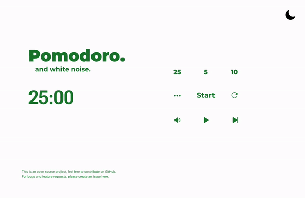
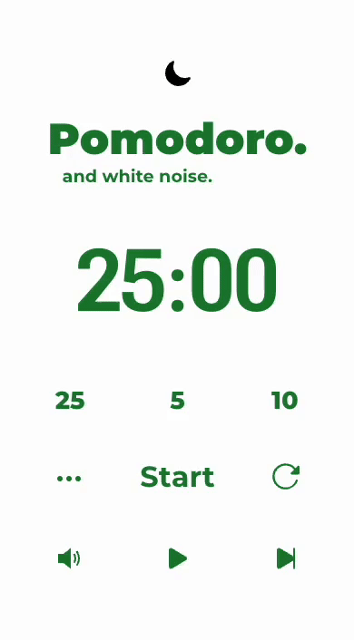

# Description

This project is a Pomodoro timer with a built-in white noise player. It uses Web Audio API to loop short audio files seamlessly and control the volume.

Feel free to try it out at: https://pomodoroandwhitenoise.com/

## Preview:

## After cloning:

- Run npm install.
- Run npm start.

## Known Bugs:

- For mobile devices, the audio stops playing when phone screen locks/turns off.
- In Firefox, the volume bar does not work and it may be due to autoplay policy in Firefox. To be fixed.
